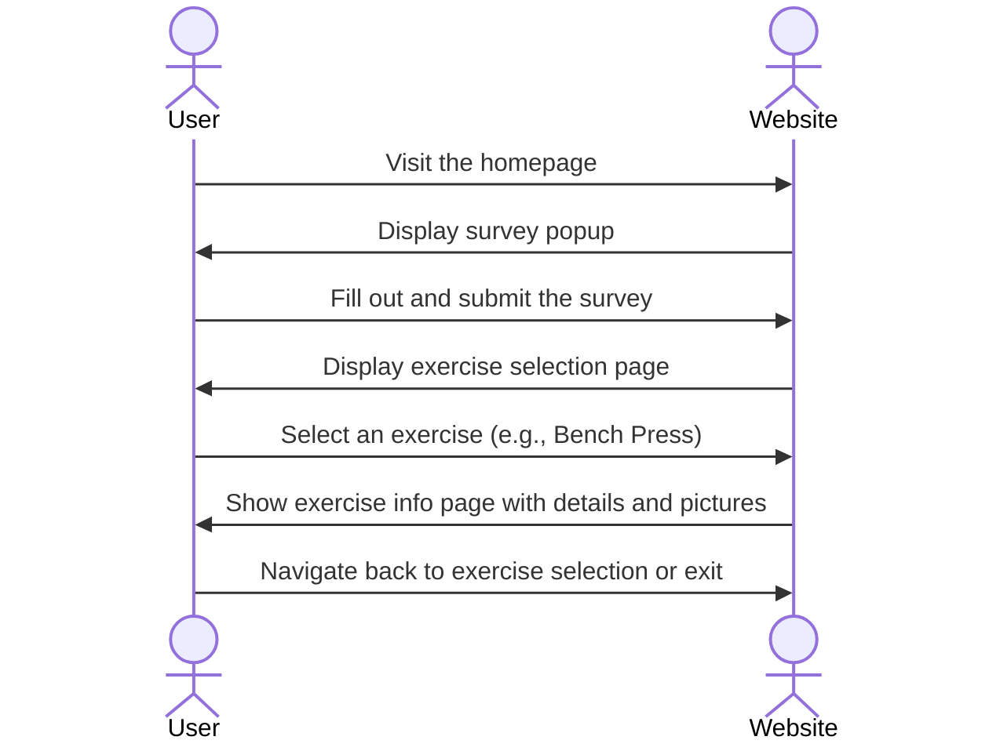

# FitInfo 

[My Notes](notes.md)

When the user visits the website, a survey up will pop up asking about basic information. Then it will ask to select which exercise they want info about such as the bench press, squats, or even deadlifts. After they select the exercise, it will take them to another page where they'll have more information and some pictures about the exercise.

> [!NOTE]
>  This is a template for your startup application. You must modify this `README.md` file for each phase of your development. You only need to fill in the section for each deliverable when that deliverable is submitted in Canvas. Without completing the section for a deliverable, the TA will not know what to look for when grading your submission. Feel free to add additional information to each deliverable description, but make sure you at least have the list of rubric items and a description of what you did for each item.

> [!NOTE]
>  If you are not familiar with Markdown then you should review the [documentation](https://docs.github.com/en/get-started/writing-on-github/getting-started-with-writing-and-formatting-on-github/basic-writing-and-formatting-syntax) before continuing.

## 🚀 Specification Deliverable

> [!NOTE]
>  Fill in this sections as the submission artifact for this deliverable. You can refer to this [example](https://github.com/webprogramming260/startup-example/blob/main/README.md) for inspiration.

For this deliverable I did the following. I checked the box `[x]` and added a description for things I completed.

- [x] Proper use of Markdown
- [x] A concise and compelling elevator pitch
- [x] Description of key features
- [x] Description of how you will use each technology
- [x] One or more rough sketches of your application. Images must be embedded in this file using Markdown image references.

### Elevator pitch

FitInfo is a simple and user-friendly website designed to help fitness enthusiats of all levels learn about key exercises like the bench press, squats, deadlifts, shoulder press, and many more! Upon visiting the site, users are greeted with quick three-question survey to get to know the user, followed by an easy-to-navigate page where they can select an exercise of interest. Each exercise has its own dedicated page with clear, concise information, tips, and visuals to guide the users in mastering proper form and understanding the benefits. FitInfo is your go-to resource for straightforward, accessible fitness knowledge! 

### Design

This is how the sequence would be when the user interacts with the program.

### Key features
- **A login page**
the user would enter his information and his information will be saved 
- **Pop-Up Survey Form** 
a simple, interactive survey that pops up when the user visits the website. It includes three basic questions(e.g, name, age, fitness level ,or fitness goals). It is ensured also that it is friendly user interface so it will have buttons such as 'next' or 'submit'.
- **Exercise Selection Page** 
After completing the survey, the user is directed to a clean and organized exercise selection page where they will have options to choose from the main weightlifting exercises.
- **Exercise Information Page**
 After clicking on the exercicse they want to learn about, it will take them into another page where it will display some information about the exercise, some images, and guides on how to do the exercise. This page should also have basic features such as a "Back to Exercise List" button where it takes them back to the main exercise page.

### Technologies

I am going to use the required technologies in the following ways.

- **HTML** - HtML will be used to structure the content of the website such as creating simple pages for the survey, exercise selection and info. Will be using things like 'header','main','section','footer' to organize content on the website logically. First Page is for the login, second is for the survey, and third is for information about the exercise.
- **CSS** - CSS will be used to style the website, making it visually appealing to the user while mainting simplicity.
- **React** - React will handle the website's dynamic behavior and component-based structure. For example to navigate between page(e.g,/ survey, /exercises, /exercise-info). Also, to create resusable components like Survey Form, Exercise List, and Exercise Info Page. 
- **Service** - Services will handle logic like processing the survey or fetching exercise data. Use a simple service to submit survey responses, or fetch exercise descriptions and images for a pre-defined list or database.
- **DB/Login** - The database will stor user data like survey responses, and login functionality can personalize user experiences.
- **WebSocket** - WebSocket can be used to add real-time interactivity, such as sending feedback or updating live data. For example, I would send a welcome message to the user after he submits his survey.

## 🚀 AWS deliverable

For this deliverable I did the following. I checked the box `[x]` and added a description for things I completed.

- [ ] **Server deployed and accessible with custom domain name** - [My server link](https://yourdomainnamehere.click).

## 🚀 HTML deliverable

For this deliverable I did the following. I checked the box `[x]` and added a description for things I completed.

- [ ] **HTML pages** - I did not complete this part of the deliverable.
- [ ] **Proper HTML element usage** - I did not complete this part of the deliverable.
- [ ] **Links** - I did not complete this part of the deliverable.
- [ ] **Text** - I did not complete this part of the deliverable.
- [ ] **3rd party API placeholder** - I did not complete this part of the deliverable.
- [ ] **Images** - I did not complete this part of the deliverable.
- [ ] **Login placeholder** - I did not complete this part of the deliverable.
- [ ] **DB data placeholder** - I did not complete this part of the deliverable.
- [ ] **WebSocket placeholder** - I did not complete this part of the deliverable.

## 🚀 CSS deliverable

For this deliverable I did the following. I checked the box `[x]` and added a description for things I completed.

- [ ] **Header, footer, and main content body** - I did not complete this part of the deliverable.
- [ ] **Navigation elements** - I did not complete this part of the deliverable.
- [ ] **Responsive to window resizing** - I did not complete this part of the deliverable.
- [ ] **Application elements** - I did not complete this part of the deliverable.
- [ ] **Application text content** - I did not complete this part of the deliverable.
- [ ] **Application images** - I did not complete this part of the deliverable.

## 🚀 React part 1: Routing deliverable

For this deliverable I did the following. I checked the box `[x]` and added a description for things I completed.

- [ ] **Bundled using Vite** - I did not complete this part of the deliverable.
- [ ] **Components** - I did not complete this part of the deliverable.
- [ ] **Router** - Routing between login and voting components.

## 🚀 React part 2: Reactivity

For this deliverable I did the following. I checked the box `[x]` and added a description for things I completed.

- [ ] **All functionality implemented or mocked out** - I did not complete this part of the deliverable.
- [ ] **Hooks** - I did not complete this part of the deliverable.

## 🚀 Service deliverable

For this deliverable I did the following. I checked the box `[x]` and added a description for things I completed.

- [ ] **Node.js/Express HTTP service** - I did not complete this part of the deliverable.
- [ ] **Static middleware for frontend** - I did not complete this part of the deliverable.
- [ ] **Calls to third party endpoints** - I did not complete this part of the deliverable.
- [ ] **Backend service endpoints** - I did not complete this part of the deliverable.
- [ ] **Frontend calls service endpoints** - I did not complete this part of the deliverable.

## 🚀 DB/Login deliverable

For this deliverable I did the following. I checked the box `[x]` and added a description for things I completed.

- [ ] **User registration** - I did not complete this part of the deliverable.
- [ ] **User login and logout** - I did not complete this part of the deliverable.
- [ ] **Stores data in MongoDB** - I did not complete this part of the deliverable.
- [ ] **Stores credentials in MongoDB** - I did not complete this part of the deliverable.
- [ ] **Restricts functionality based on authentication** - I did not complete this part of the deliverable.

## 🚀 WebSocket deliverable

For this deliverable I did the following. I checked the box `[x]` and added a description for things I completed.

- [ ] **Backend listens for WebSocket connection** - I did not complete this part of the deliverable.
- [ ] **Frontend makes WebSocket connection** - I did not complete this part of the deliverable.
- [ ] **Data sent over WebSocket connection** - I did not complete this part of the deliverable.
- [ ] **WebSocket data displayed** - I did not complete this part of the deliverable.
- [ ] **Application is fully functional** - I did not complete this part of the deliverable.
