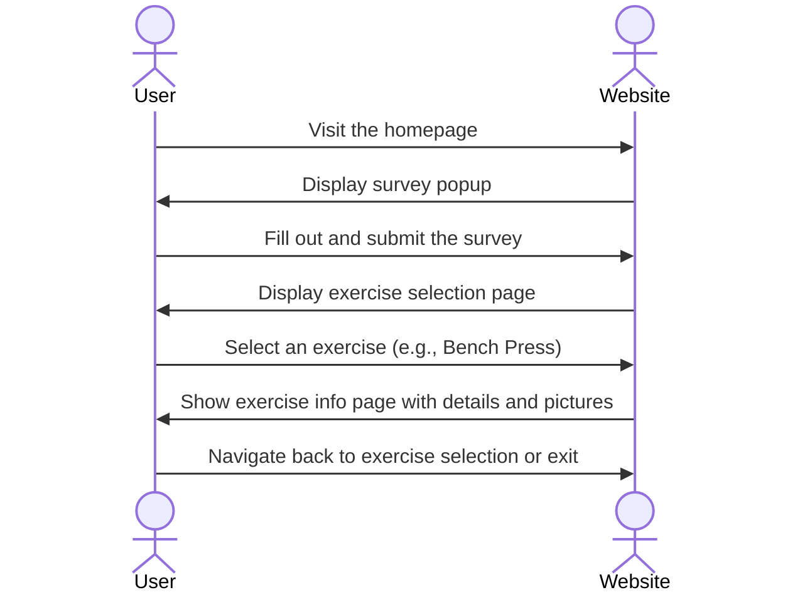

# FitInfo 

[My Notes](notes.md)

When the user visits the website, a survey up will pop up asking about basic information. Then it will ask to select which exercise they want info about such as the bench press, squats, or even deadlifts. After they select the exercise, it will take them to another page where they'll have more information and some pictures about the exercise.

> [!NOTE]
>  This is a template for your startup application. You must modify this `README.md` file for each phase of your development. You only need to fill in the section for each deliverable when that deliverable is submitted in Canvas. Without completing the section for a deliverable, the TA will not know what to look for when grading your submission. Feel free to add additional information to each deliverable description, but make sure you at least have the list of rubric items and a description of what you did for each item.

> [!NOTE]
>  If you are not familiar with Markdown then you should review the [documentation](https://docs.github.com/en/get-started/writing-on-github/getting-started-with-writing-and-formatting-on-github/basic-writing-and-formatting-syntax) before continuing.

## 🚀 Specification Deliverable

> [!NOTE]
>  Fill in this sections as the submission artifact for this deliverable. You can refer to this [example](https://github.com/webprogramming260/startup-example/blob/main/README.md) for inspiration.

For this deliverable I did the following. I checked the box `[x]` and added a description for things I completed.

- [x] Proper use of Markdown
- [x] A concise and compelling elevator pitch
- [x] Description of key features
- [x] Description of how you will use each technology
- [x] One or more rough sketches of your application. Images must be embedded in this file using Markdown image references.

### Elevator pitch

FitInfo is a simple and user-friendly website designed to help fitness enthusiats of all levels learn about key exercises like the bench press, squats, deadlifts, shoulder press, and many more! Upon visiting the site, users are greeted with quick three-question survey to get to know the user, followed by an easy-to-navigate page where they can select an exercise of interest. Each exercise has its own dedicated page with clear, concise information, tips, and visuals to guide the users in mastering proper form and understanding the benefits. FitInfo is your go-to resource for straightforward, accessible fitness knowledge! 

### Design

This is how the sequence would be when the user interacts with the program.

### Key features
- **A Login Page**   
  the user would enter his information and his information will be saved 
- **Pop-Up Survey Form**  
  a simple, interactive survey that pops up when the user visits the website. It includes three basic questions(e.g, name, age, fitness level ,or fitness goals). It is ensured also that it is friendly user interface so it will have buttons such as 'next' or 'submit'.
- **Exercise Selection Page**   
  After completing the survey, the user is directed to a clean and organized exercise selection page where they will have options to choose from the main weightlifting exercises.
- **Exercise Information Page**  
  After clicking on the exercicse they want to learn about, it will take them into another page where it will display some information about the exercise, some images, and guides on how to do the exercise. This page should also have basic features such as a "Back to Exercise List" button where it takes them back to the main exercise page.

### Technologies

I am going to use the required technologies in the following ways.

- **HTML** - HtML will be used to structure the content of the website such as creating simple pages for the survey, exercise selection and info. Will be using things like 'header','main','section','footer' to organize content on the website logically. First Page is for the login, second is for the survey, and third is for information about the exercise.
- **CSS** - CSS will be used to style the website, making it visually appealing to the user while mainting simplicity.
- **React** - React will handle the website's dynamic behavior and component-based structure. For example to navigate between page(e.g,/ survey, /exercises, /exercise-info). Also, to create resusable components like Survey Form, Exercise List, and Exercise Info Page. 
- **Service** - Services will handle logic like processing the survey or fetching exercise data. Use a simple service to submit survey responses, or fetch exercise descriptions and images for a pre-defined list or database.
- **DB/Login** - The database will stor user data like survey responses, and login functionality can personalize user experiences.
- **WebSocket** - WebSocket can be used to add real-time interactivity, such as sending feedback or updating live data. For example, I would send a welcome message to the user after he submits his survey.
- **External Service** - I will be using Pexels API the purpose of this is to dynamically fetch high-quality exercise images for the exercise information page.

## 🚀 AWS deliverable

For this deliverable I did the following. I checked the box `[x]` and added a description for things I completed.

- [x] **Server deployed and accessible with custom domain name** - [My server link](https://fitinfo.click/).

## 🚀 HTML deliverable

For this deliverable I did the following. I checked the box `[x]` and added a description for things I completed.

- [x] **HTML pages** - I completed this part of the deliverable by having multiple HTML pages such as index.html, survey.html, and results.html and within results.html the user will be be able to navigate to other pages to get information about the exercises. index.html will take care of logging in.
- [x] **Proper HTML element usage** - I did use multiple elements to divide the page up into different parts and for organization. To help structure the pages more I included headers, footers, body, navigation, button, and more.
- [x] **Links** - On each HTML page, the user will have a way to navigate to the other pages such as to return to the home page, to the survey page, and to the exercise selection page.
- [x] **Text** - I included a lot of text that would help the user know the information about the website and I included some information about the website itself.
- [x] **3rd party API placeholder** - In the home page of the website there will be a motivational quote generator. that would update everyday. Now, I have a placeholder that has a random quote in there, but that later would change everyday.
- [x] **Images** - I included images and videos to help the user understand how the exercise should be done. I also added some visuals to  help the user understand the muslces targeted in the exercises.
- [x] **Login placeholder** - I included a login and username where it will make the user login it also has create and login buttons.
- [x] **DB data placeholder** - After the user answers the questions on the surver, his questions will be updated in the table that is now as placeholders but then will change in the future.
- [x] **WebSocket placeholder** - I have as my websocket placeholder a live notifications pop-up message, where it will give the new user a notifaction if a user completed the survey.
## 🚀 CSS deliverable

For this deliverable I did the following. I checked the box `[x]` and added a description for things I completed.

- [x] **Header, footer, and main content body** - I completed this part of the deliverable, and I did structure the page in a way that it wraps the texts the things inlcuded in a header, footer, and main content body. Also the header, footer and main content body each of them is in a different block.
- [x] **Navigation elements** - In every single page I include navigation elements that helps the user navigate between pages. I also styled the navigation elements.
- [x] **Responsive to window resizing** - I made sure that every page is responsive to a different sized window such as using "max-width' to resizing the image and make it adaptable to the page size.
- [x] **Application elements** - I did inlcude styling to every single aspect in the website such as images, texts, and vidos. I also centered the logging in in the middle.
- [x] **Application text content** - I did inlcude all the texts and the information about the website and changed the fonts and styled the some specific lines that are supposed to help the user navigate through different parts of the website. 
- [x] **Application images** - I did include multiple images for visual representation. I also style the images and the videos so that when a peson hovers over it would have an animation effect.

## 🚀 React part 1: Routing deliverable

For this deliverable I did the following. I checked the box `[x]` and added a description for things I completed.

- [x] **Bundled using Vite** - I installed vite and bundled everything up using vite.
- [x] **Components** - I did use react components to be able to include all html and other files.
- [x] **Router** - I did router my files in a way that it would not use html files 

## 🚀 React part 2: Reactivity

For this deliverable I did the following. I checked the box `[x]` and added a description for things I completed.

- [x] **All functionality implemented or mocked out** - I added functions to make my website interactive.
- [x] **Hooks** - I used react hooks to write my code and make my website interactive

## 🚀 Service deliverable

For this deliverable I did the following. I checked the box `[x]` and added a description for things I completed.

- [x] **Node.js/Express HTTP service** - I did include node.js and Express HTTP service in my website
- [x] **Static middleware for frontend** - I completed a static middleware for the fronted of my website 
- [x] **Calls to third party endpoints** - I did include bjcrypt.js and cookie-parser to call for 3rd party apis for my endpoints
- [x] **Backend service endpoints** - I did implement that in my website that use the API routes 
- [x] **Frontend calls service endpoints** - I used a 3rd party API for a random quote generator and it is implemented in my login page

## 🚀 DB/Login deliverable

For this deliverable I did the following. I checked the box `[x]` and added a description for things I completed.

- [x] **User registration** - I completed this part of the deliverable.
- [x] **User login and logout** - I completed this part of the deliverable.
- [x] **Stores data in MongoDB** - I completed this part of the deliverable. it successfuly stores data in MongoDB
- [x] **Stores credentials in MongoDB** - Whenever a user logs in or creates an account it connects to the database MongoDB
- [x] **Restricts functionality based on authentication** - I did complete this part of the deliverable. The user will not be able to navigate throught the pages without being logged in.

## 🚀 WebSocket deliverable

For this deliverable I did the following. I checked the box `[x]` and added a description for things I completed.

- [ ] **Backend listens for WebSocket connection** - I did not complete this part of the deliverable.
- [ ] **Frontend makes WebSocket connection** - I did not complete this part of the deliverable.
- [ ] **Data sent over WebSocket connection** - I did not complete this part of the deliverable.
- [ ] **WebSocket data displayed** - I did not complete this part of the deliverable.
- [ ] **Application is fully functional** - I did not complete this part of the deliverable.
